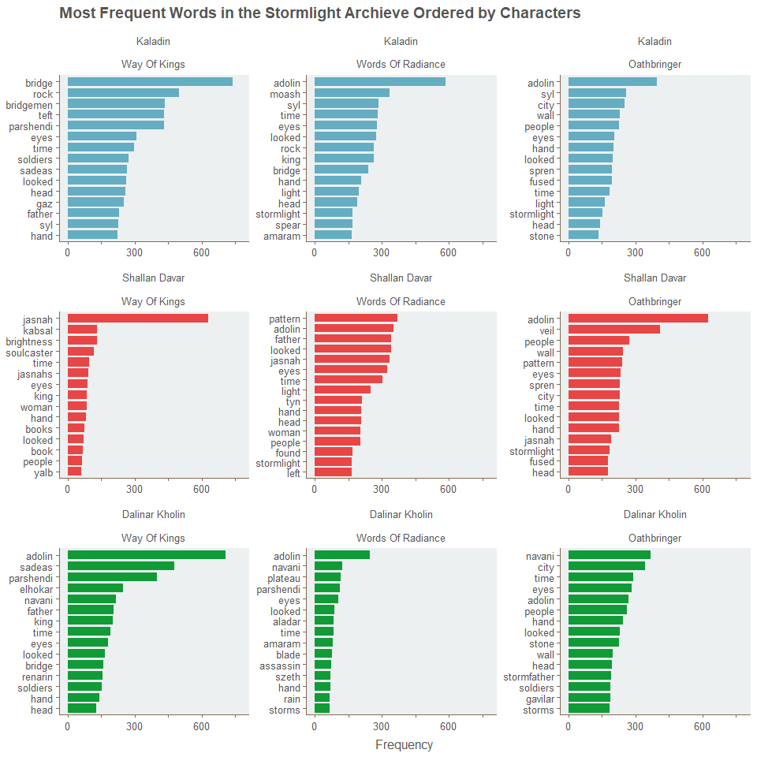
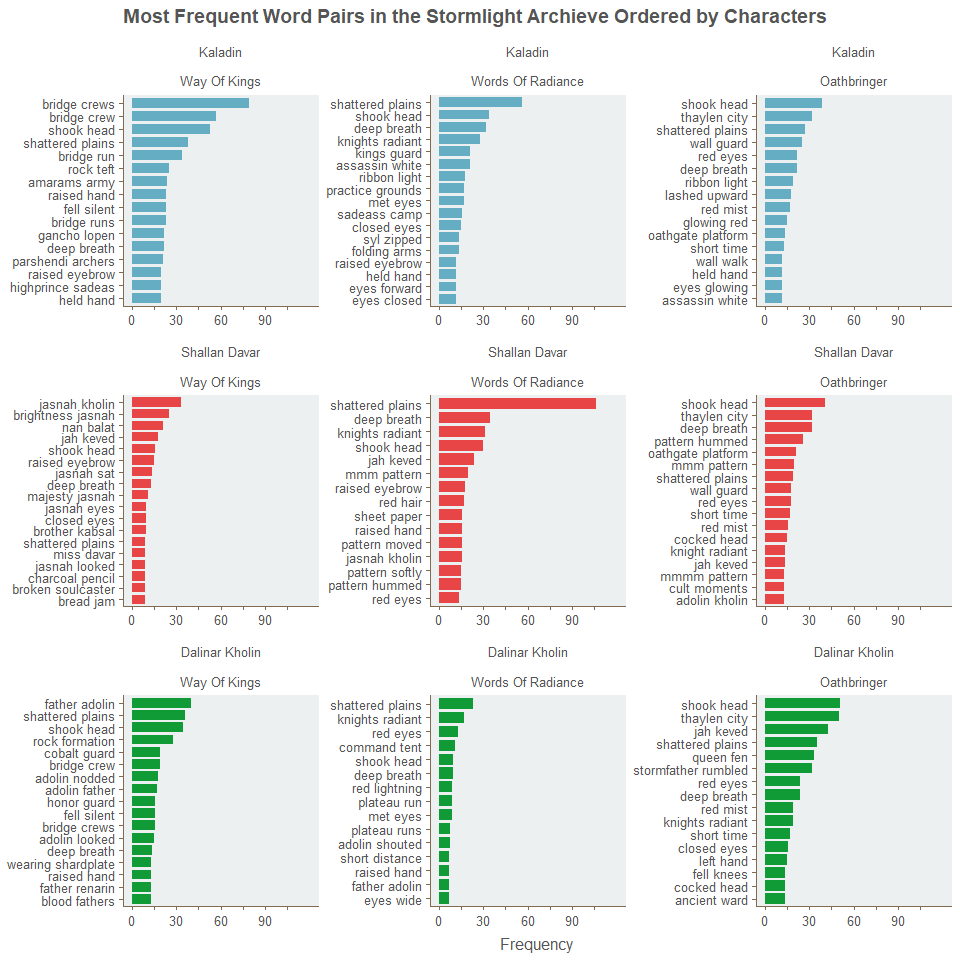
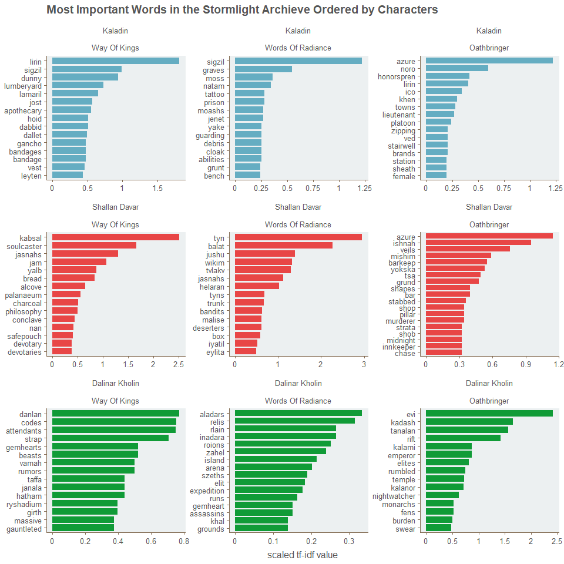
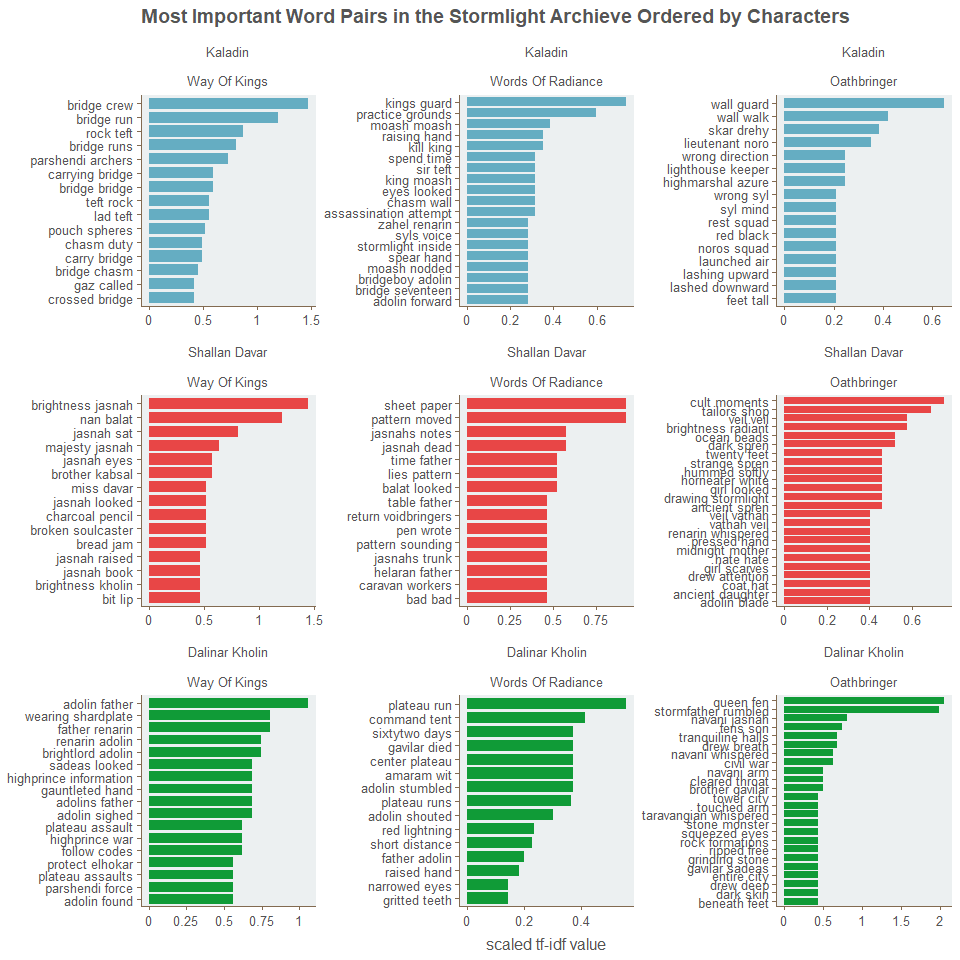

Additional analysis of the Stormlight Archive
================

<details> <summary>`Preparation Code`</summary>

``` r
library(tidyr)
library(tidytext)
library(dplyr)
library(ggplot2)
library(ggthemr)
library(gridExtra)
library(stringr)
ggthemr('fresh', layout = "minimal")

source("loadData/loadData.R")

AllBooks <- AllBooks[, c("chapter", "nr", "text", "character", "book", "flashback")]
AllBooks <- AllBooks[!is.na(AllBooks$nr),]

rm(list=setdiff(ls(), "AllBooks"))

relChars <- c("Kaladin", "Shallan Davar", "Dalinar Kholin")
stopwords <- c(unique(stop_words$word), "kaladin", "dalinar", "shallan", "kal", "kals", "kaladins", "dalinars", "shallans")
stopwords <- c(stopwords, gsub("[^[:alnum:][:space:]]", "", stopwords))
stopwords <- unique(stopwords)

idf_smooth <- function(idf){
  idf <- log(1 + 2^(idf), base = 2)
  return(idf)
}
```

</details> <details> <summary>`Code`</summary>

``` r
char_words_tokens <- AllBooks %>% 
  select(character, text, book) %>% 
  filter(character %in% relChars) %>% 
  unnest_tokens(word, text, drop = F) %>% 
  select(-text) %>% 
  #mutate(word = SnowballC::wordStem(word, language = "english")) %>% 
  group_by(book) %>% 
  count(character, word, sort = TRUE) %>% 
  ungroup() %>% 
  filter(!word %in% stopwords)%>% 
  filter(n > 10)

char_words_ngrams <- AllBooks %>% 
  select(character, text, book) %>%  
  filter(character %in% relChars) %>% 
  unnest_tokens(word, text, token = "skip_ngrams", n = 2, k = 3, drop = F) %>% 
  select(-text) %>% 
  filter(str_count(word, "\\w+")  == 2) %>% 
  separate(word, c("word1", "word2"), sep = " ") %>% 
  #mutate(word = SnowballC::wordStem(word1, language = "english")) %>% 
  #mutate(word = SnowballC::wordStem(word2, language = "english")) %>% 
  filter(!word1 %in% stopwords) %>%
  filter(!word2 %in% stopwords) %>% 
  unite(word, word1, word2, sep = " ") %>% 
  group_by(book) %>% 
  count(character, word, sort = TRUE) %>% 
  ungroup() %>% 
  filter(n > 5)

char_words_tokens$character <- factor(char_words_tokens$character, levels = relChars)
char_words_ngrams$character <- factor(char_words_ngrams$character, levels = relChars)


plot_char_words_tokens <- char_words_tokens %>% 
  group_by(character, book) %>%
  top_n(15, n) %>% 
  ungroup() %>% 
  mutate(index = seq(1, length(n), 1)) %>% 
  unite("ordering", character, index, sep = "_", remove = FALSE) %>% 
  data.frame() %>% 
  mutate(ordering = factor(ordering, levels = ordering))

plot_char_words_ngrams <- char_words_ngrams %>% 
  group_by(character, book) %>%
  top_n(15, n) %>% 
  ungroup() %>% 
  mutate(index = seq(1, length(n), 1)) %>% 
  unite("ordering", character, index, sep = "_", remove = FALSE) %>% 
  data.frame() %>% 
  mutate(ordering = factor(ordering, levels = ordering))

c1 <- ggplot(plot_char_words_tokens, aes(reorder(ordering, n), n, fill = character)) +
  geom_col(show.legend = FALSE, width = 0.8) +
  facet_wrap(~character+book, scales = "free", drop = TRUE) +
  scale_x_discrete(breaks = plot_char_words_tokens$ordering,
                   labels = plot_char_words_tokens$word) +
  scale_y_continuous(limits = c(0, 775), 
                     labels = c(0, rep("",1), 300, rep("",1), 600, rep("",1)),
                     breaks= seq(0, 750, by = 150)) + 
  labs( y = "Frequency",
        x = NULL) +
  coord_flip()+
  theme(panel.background = element_rect(fill = "#ecf0f1")) + 
  scale_fill_manual(values = swatch()[c(2, 4, 9)]) +
  ggtitle("Most Frequent Words in the Stormlight Archieve Ordered by Characters")

c2 <- ggplot(plot_char_words_ngrams, aes(reorder(ordering, n), n, fill = character)) +
  geom_col(show.legend = FALSE, width = 0.8) +
  facet_wrap(~character+book, scales = "free", drop = TRUE) +
  scale_x_discrete(breaks = plot_char_words_ngrams$ordering,
                   labels = plot_char_words_ngrams$word) +
  scale_y_continuous(limits = c(0, 120), 
                     labels = c(0, rep("",1), 30, rep("",1), 60, rep("",1), 90, rep("",1)),
                     breaks= seq(0, 105, by = 15)) + 
  labs( y = "Frequency",
        x = NULL) +
  coord_flip()+
  theme(panel.background = element_rect(fill = "#ecf0f1")) + 
  scale_fill_manual(values = swatch()[c(2, 4, 9)]) +
  ggtitle("Most Frequent Word Pairs in the Stormlight Archieve Ordered by Characters")

# Same with TFIDF
plot_char_words_tokens_tfidf <- char_words_tokens %>% 
  group_by(character, book) %>%
  bind_tf_idf(word, character, n) %>% 
  top_n(15, tf_idf) %>% 
  ungroup() %>% 
  mutate(index = seq(1, length(n), 1)) %>% 
  unite("ordering", character, index, sep = "_", remove = FALSE) %>% 
  data.frame() %>% 
  mutate(ordering = factor(ordering, levels = ordering)) %>% 
  mutate(idf = idf_smooth(idf)) %>%  
  mutate(tf_idf = tf*idf)

plot_char_words_ngrams_tfidf <- char_words_ngrams %>% 
  group_by(character, book) %>%
  bind_tf_idf(word, character, n) %>% 
  top_n(15, tf_idf) %>% 
  ungroup() %>% 
  mutate(index = seq(1, length(n), 1)) %>% 
  unite("ordering", character, index, sep = "_", remove = FALSE) %>% 
  data.frame() %>% 
  mutate(ordering = factor(ordering, levels = ordering)) %>% 
  mutate(idf = idf_smooth(idf)) %>%  
  mutate(tf_idf = tf*idf)

c1_tfidf <- ggplot(plot_char_words_tokens_tfidf, aes(reorder(ordering, tf_idf), tf_idf, fill = character)) +
  geom_col(show.legend = FALSE, width = 0.8) +
  facet_wrap(~character+book, scales = "free", drop = TRUE) +
  scale_x_discrete(breaks = plot_char_words_tokens_tfidf$ordering,
                   labels = plot_char_words_tokens_tfidf$word) +
  scale_y_continuous(labels = function(x) x*1000) +
  labs( y = "scaled tf-idf value",
        x = NULL) +
  coord_flip()+
  theme(panel.background = element_rect(fill = "#ecf0f1")) + 
  scale_fill_manual(values = swatch()[c(2, 4, 9)]) +
  ggtitle("Most Important Words in the Stormlight Archieve Ordered by Characters")

c2_tfidf <- ggplot(plot_char_words_ngrams_tfidf, aes(reorder(ordering, tf_idf), tf_idf, fill = character)) +
  geom_col(show.legend = FALSE, width = 0.8) +
  facet_wrap(~character+book, scales = "free", drop = TRUE) +
  scale_x_discrete(breaks = plot_char_words_ngrams_tfidf$ordering,
                   labels = plot_char_words_ngrams_tfidf$word) +
  scale_y_continuous(labels = function(x) x*100) +
  labs( y = "scaled tf-idf value",
        x = NULL) +
  coord_flip()+
  theme(panel.background = element_rect(fill = "#ecf0f1")) + 
  scale_fill_manual(values = swatch()[c(2, 4, 9)]) +
  ggtitle("Most Important Word Pairs in the Stormlight Archieve Ordered by Characters")
```

</details>

I partitioned the analysis a bit more here: Everything is split by characters and by books. This means that we will see 9 plots for each analysis.

One can see:

1.  The most frequent words
2.  The most frequent word pairs
3.  The most important words by TfIdf
4.  The most important word pairs by TfIdf

By splitting the word frequencies of each character by books, the analysis gets more insightful about what exactly is happening in each book with each character. Looking at the absolute frequency of word pairs is a rather simple way to look at text, but it gives us information about the authors quirks and what words he uses a lot. One can see that there is a lot of head shaking going on in *the Stormlight Archive*! <br> <br>  <br> <br>  <br> <br>  <br> <br> 
