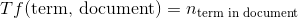
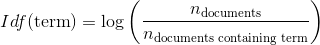
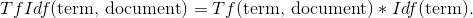
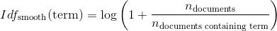
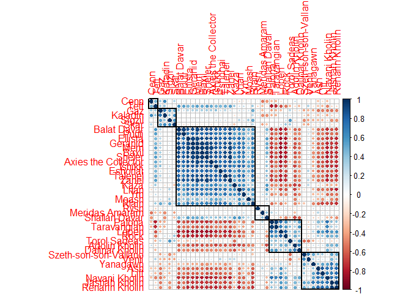

'The Stormlight Archive' Analysis
================

-   [A text analysis of 'The Stormlight Archive' by Brandon Sanderson](#a-text-analysis-of-the-stormlight-archive-by-brandon-sanderson)
    -   [Data Preparation](#data-preparation)
    -   [On Which Character Does Each Book Focus On?](#on-which-character-does-each-book-focus-on)
    -   [What Do Different Word Frequencies Tell Us?](#what-do-different-word-frequencies-tell-us)
        -   [The Most Important Words for Each Book According to Tfidf](#the-most-important-words-for-each-book-according-to-tfidf)
        -   [The Most Important Words for Certain Characters According to Tfidf](#the-most-important-words-for-certain-characters-according-to-tfidf)
        -   [Some Additional Information About Word Frequencies in General](#some-additional-information-about-word-frequencies-in-general)
        -   [Characteristics about TfIdf on Books](#characteristics-about-tfidf-on-books)
    -   [Clustering chapters for each character](#clustering-chapters-for-each-character)

In this repo, one can find my code and different things I tried to analyse the popular fantasy series *'The Stormlight Archive'* by *Brandon Sanderson*. I will describe most things that I did here as they might be interesting for some fans of the series.

A text analysis of 'The Stormlight Archive' by Brandon Sanderson
================================================================

Recently I was working with a lot of text data and thought about a topic on which I could apply my new knowledge. One of the best things to exercise some analysis is to dig into a topic one knows a lot about. It makes it easier to validate different methods and models which tend to be very abstract and obscure if they are applied on seemingly random numbers.

As a fan of Brandon Sanderson books, I thought it might be interesting to use some usual text analysis methods on 'The Stormlight Archive'. The type of text I usually encounter is fairly short and consists of everyday language like tweets or emails. A ~1200 page book has a few differences:

-   Chapters have a lot more than 280 characters
-   Every chapter is written by the same author thus has very similar characteristics
-   There is an overall topic a book is about
-   The texts are very descriptive and usually about a character and from their point of view

My goal will now be to see how those differences influence typical natural language processing tasks. I will

-   Prepare the data
-   Point about which character a book is focusing on
-   Look at the word frequencies to
    -   get an idea about the topic of each book
    -   see whether chapters about certain characters differ on their word frequencies and what those tell us compared to word frequencies in shorter documents

Data Preparation
----------------

I have the books as different .epub files. A .epub is basically a zipped file format. By unzipping it, we are able to extract each chapter as a unique file. I described in `loadData/loadData.R` and the other files in that folder how I was able to scrape the text of each book and get them into a manageable format. A big advantage in the context of analysing books is that they are written and edited by an author. So I can happily believe that there are no major mistakes or other impurity in the texts which have to be respected.

Keep in mind, that the books are not included in this github repository for obvious reasons.

<details> <summary>Code</summary>

``` r
library(tidyr)
library(tidytext)
library(dplyr)
library(ggplot2)
library(ggthemr)
library(gridExtra)
library(grid)
library(stringr)
ggthemr('fresh', layout = "minimal") # beautifull plots

source("loadData/loadData.R")

AllBooks <- AllBooks[, c("chapter", "nr", "text", "character", "book", "flashback")]
# Get only rows which actually are chapters with text and not blank pages, maps or other things
AllBooks <- AllBooks[!is.na(AllBooks$nr),]
# remove everything except the data.frame AllBooks
rm(list=setdiff(ls(), "AllBooks"))

# The relevant characters
relChars <- c("Kaladin", "Shallan Davar", "Dalinar Kholin")
# Get stopwords and include the names of the relevant characters as they appear everywhere across each book
stopwords <- c(unique(stop_words$word), "kaladin", "dalinar", "shallan", "kal", "kals", "kaladins", "dalinars", "shallans")
stopwords <- c(stopwords, gsub("[^[:alnum:][:space:]]", "", stopwords))
stopwords <- unique(stopwords)
```

</details>

On Which Character Does Each Book Focus On?
-------------------------------------------

I simply counted the number of chapters associated with *Kaladin*, *Shallan* or *Dalinar* and highlighted the number of chapters which are flashbacks. <details> <summary>Code</summary>

``` r
# Count the frequency of the relevant characters in each book
chars <- AllBooks %>% 
  select(character, flashback, book) %>% 
  group_by(character, book) %>% 
  count(flashback) %>% 
  ungroup() %>% 
  arrange(flashback, desc(n)) %>% 
  filter(character %in% relChars)
# Fix the order in the plot 
chars$character <- factor(chars$character, levels = rev(relChars))
# Plot
charPlot <- ggplot(chars, aes( x = character, y = n, fill = flashback)) +
  geom_bar(stat = "identity", position = position_stack(reverse = TRUE)) +
  facet_wrap(~book) +
  theme(panel.background = element_rect(fill = "#ecf0f1")) + 
  scale_fill_manual(values = swatch()[c(7,2)]) +
  ggtitle("Number of Chapters of Each Character Ordered by Books") +
  labs(x = NULL,
       y = "Number of chapters",
       fill = "Flashback") + 
  coord_flip()

#charPlot
```

</details> 

By looking whether a character has flashbacks or not, it becomes clear who a book focuses about. One can see that *Shallan's* role was minor in the first book and that all characters are about equal in *Oathbringer*.

I was able to do this easy approach with the help of the *Coppermind* community which published a table that specifies the point of view of each chapter. I can not simply assume to have additional data like this to work with in every analysis. Another way is to count the appearance of each character in every chapter per book and plot the percentage of how often *Kaladin*, *Shallan* or *Dalinar* gets mentioned.

<details> <summary>Code</summary>

``` r
# This code has a lot of lines as everything needs to be done for each book

# Transform the text a bit to make it easier to handle. 
# Change nicknames of characters to their normal names
AllBooks$text <- tolower(AllBooks$text)
AllBooks$text <- paste(" ", AllBooks$text)
AllBooks$text <- gsub("(\\skaladins\\s|\\skal\\s|\\skals\\s)", " kaladin ", AllBooks$text)
AllBooks$text <- gsub("(\\sshallans\\s)", " shallan ", AllBooks$text)
AllBooks$text <- gsub("(\\sdalinars\\s)", " dalinar ", AllBooks$text)

stopwords <- unique(stop_words$word)
stopwords <- c(stopwords, gsub("[^[:alnum:][:space:]]", "", stopwords))
stopwords <- unique(stopwords)

# Separate each book
WoK <- AllBooks[AllBooks$book == "Way Of Kings", c("nr", "text")]
WoR <- AllBooks[AllBooks$book == "Words Of Radiance", c("nr", "text")]
Oath <- AllBooks[AllBooks$book == "Oathbringer", c("nr", "text")]

# Create index variable
WoK$index <- seq(1, nrow(WoK), 1)
WoR$index <- seq(1, nrow(WoR), 1)
Oath$index <- seq(1, nrow(Oath), 1)

# Tokenize the text and count them
# Keep relChars only
relChars <- c("kaladin", "shallan", "dalinar")
WoK_tokens <- WoK %>% 
  select(text, index) %>% 
  unnest_tokens(word, text) %>% 
  mutate(word = SnowballC::wordStem(word, language = "english")) %>% 
  count(index, word, sort = TRUE) %>% 
  ungroup() %>% 
  filter(word %in% relChars) %>% 
  arrange(index)

WoR_tokens <- WoR %>% 
  select(text, index) %>% 
  unnest_tokens(word, text) %>% 
  mutate(word = SnowballC::wordStem(word, language = "english")) %>% 
  count(index, word, sort = TRUE) %>% 
  ungroup() %>% 
  filter(word %in% relChars) %>% 
  arrange(index)

Oath_tokens <- Oath %>% 
  select(text, index) %>% 
  unnest_tokens(word, text) %>% 
  mutate(word = SnowballC::wordStem(word, language = "english")) %>% 
  count(index, word, sort = TRUE) %>% 
  ungroup() %>% 
  filter(word %in% relChars) %>% 
  arrange(index)

# Capitalization 
WoK_tokens$word <- gsub("kaladin", "Kaladin", WoK_tokens$word)
WoK_tokens$word <- gsub("shallan", "Shallan", WoK_tokens$word)
WoK_tokens$word <- gsub("dalinar", "Dalinar", WoK_tokens$word)

WoR_tokens$word <- gsub("kaladin", "Kaladin", WoR_tokens$word)
WoR_tokens$word <- gsub("shallan", "Shallan", WoR_tokens$word)
WoR_tokens$word <- gsub("dalinar", "Dalinar", WoR_tokens$word)

Oath_tokens$word <- gsub("kaladin", "Kaladin", Oath_tokens$word)
Oath_tokens$word <- gsub("shallan", "Shallan", Oath_tokens$word)
Oath_tokens$word <- gsub("dalinar", "Dalinar", Oath_tokens$word)

# Faktor fixes the ordering in their plots
WoK_tokens$word <- factor(WoK_tokens$word, levels = c("Kaladin", "Shallan", "Dalinar"))
WoR_tokens$word <- factor(WoR_tokens$word, levels = c("Kaladin", "Shallan", "Dalinar"))
Oath_tokens$word <- factor(Oath_tokens$word, levels = c("Kaladin", "Shallan", "Dalinar"))

# I want to calculate the percentage of appearances of each character in each chapter
WoK_tokens <- spread(WoK_tokens, key = word, value = n) %>% 
  replace_na(list(Kaladin = 0, Shallan = 0, Dalinar = 0)) %>% 
  gather(word, n, -index)

WoR_tokens <- spread(WoR_tokens, key = word, value = n) %>% 
  replace_na(list(Kaladin = 0, Shallan = 0, Dalinar = 0)) %>% 
  gather(word, n, -index)

Oath_tokens <- spread(Oath_tokens, key = word, value = n) %>% 
  replace_na(list(Kaladin = 0, Shallan = 0, Dalinar = 0)) %>% 
  gather(word, n, -index)
# Calc proportion
WoK_fun = function(vec){ as.numeric(vec[3]) / sum(WoK_tokens$n[ WoK_tokens$index == as.numeric(vec[1]) ]) *100 }
WoR_fun = function(vec){ as.numeric(vec[3]) / sum(WoR_tokens$n[ WoR_tokens$index == as.numeric(vec[1]) ]) *100 }
Oath_fun = function(vec){ as.numeric(vec[3]) / sum(Oath_tokens$n[ Oath_tokens$index == as.numeric(vec[1]) ]) *100 }

WoK_tokens$prop = apply(WoK_tokens , 1 , WoK_fun)
WoR_tokens$prop = apply(WoR_tokens , 1 , WoR_fun)
Oath_tokens$prop = apply(Oath_tokens , 1 , Oath_fun)

WoK_tokens$word <- factor(WoK_tokens$word, levels = c("Kaladin", "Shallan", "Dalinar"))
WoR_tokens$word <- factor(WoR_tokens$word, levels = c("Kaladin", "Shallan", "Dalinar"))
Oath_tokens$word <- factor(Oath_tokens$word, levels = c("Kaladin", "Shallan", "Dalinar"))

# Plots
prop_wok <- ggplot(WoK_tokens, aes(x = index, y = prop, fill = word)) + 
  geom_area(alpha=0.6 , size=.5, colour="black")+
  labs( x = " ",
        y = "Percentage") + 
  theme(legend.position = "top",
      legend.margin=margin(t = 0, unit='cm'),
      legend.text = element_text(color = "white"),
      legend.title = element_text(color = "white"),
      legend.key = element_rect(fill = "white"))  + 
  scale_fill_manual(values = swatch()[c(2, 4, 9)],
                    guide = guide_legend(override.aes = list(fill = "white",
                                         color = "white"))
                    )

prop_wor <- ggplot(WoR_tokens, aes(x = index, y = prop, fill = word)) + 
  geom_area(alpha=0.6 , size=.5, colour="black") +
  labs( x = "Chapter",
        y = "",
        fill = "") + 
  theme(legend.position = "top",
        legend.margin=margin(t = 0, unit='cm')) +
  scale_fill_manual(values = swatch()[c(2, 4, 9)]
                    )

prop_oath <- ggplot(Oath_tokens, aes(x = index, y = prop, fill = word)) + 
  geom_area(alpha=0.6 , size=.5, colour="black") +
  labs( x = " ",
        y = " ")  +
  theme(legend.position = "top",
        legend.margin=margin(t = 0, unit='cm'),
        legend.text = element_text(color = "white"),
        legend.title = element_text(color = "white"),
        legend.key = element_rect(fill = "white")) + 
  scale_fill_manual(values = swatch()[c(2, 4, 9)],
                    guide = guide_legend(override.aes = list(fill = "white",
                                                             color = "white"))
                    )

library(grid)
#grid.arrange(prop_wok, prop_wor, prop_oath, ncol = 3, top = textGrob("Percentage of How Often a Character Is Mentioned in Each Chapter",gp=gpar(fontsize=18,font=3)))
```

</details> 

One can see two additional things here:

1.  It is evident that the characters start to interact with each other more in the course of the series and the point of views are changed more often
2.  There is a difference in the last third of the book. Fans refer to that part as the **Brandon Avalanche**/**Sanderson Avalanche**.

Sanderson Avalanche:

> A trademark in Brandon Sanderson's books is that in the end of the book, the pace starts to pick up dramatically. It seems like the book breaks apart while many threads start to connect, all the characters meet and the climax begins.

What Do Different Word Frequencies Tell Us?
-------------------------------------------

A common technique to analyse texts is to look at word frequencies and then weight them by different factors. The most common concept there is the [Tf-Idf meassure](https://en.wikipedia.org/wiki/Tf%E2%80%93idf) which is short for term frequency–inverse document frequency. The meaning behind document can be substituted for texts written by different authors, chapters or text grouped by other characteristics. The goal behind it is to find words which describe one document of a group particularly well.

It is defined by

<p align="center">

</p>
<p align="center">

</p>
<p align="center">

</p>
The *Tf* value is usually scaled with the highest term frequency in the document. The logarithm is used as a weighting scheme to give words that appear in many documents a smaller weight. There are many different formulas one can use. Another popular one is the smooth Idf which adds  in the logarithm to prevent giving a word that appears in every document a value of :

<p align="center">

</p>
We can define a document in a few useful ways here:

1.  Define a document as a book
2.  Define a document as a text from the viewpoint of a character.

The *Tf-Idf* measure can now be used to find words which descibe one book or one character by only looking at the words appearing in the right class of texts. We will do this analysis twice: Once by just looking at the frequencies of single words and then by looking at the frequency of word pairs. The word pairs will be defined as a pair of one word *Word1* and another word which appears 2 words before or after it. This gives us a bit more context.

When we try to describe a character in that way, it is important to note that it will (usually) not be adjectives which are associated to that character, but any word that appears often.

We will also see that finding important words by their *TfIdf* value for books results in something I found interesting compared to tweets and emails.

<details> <summary>Preparation Code</summary>

``` r
source("loadData/loadData.R")

AllBooks <- AllBooks[, c("chapter", "nr", "text", "character", "book", "flashback")]
AllBooks <- AllBooks[!is.na(AllBooks$nr),]

rm(list=setdiff(ls(), "AllBooks"))

relChars <- c("Kaladin", "Shallan Davar", "Dalinar Kholin")
stopwords <- c(unique(stop_words$word), "kaladin", "dalinar", "shallan", "kal", "kals", "kaladins", "dalinars", "shallans")
stopwords <- c(stopwords, gsub("[^[:alnum:][:space:]]", "", stopwords))
stopwords <- unique(stopwords)

# A function for the tfidf-calculation
idf_smooth <- function(idf){
  idf <- log(1 + 2^(idf), base = 2)
  return(idf)
}
```

</details>

### The Most Important Words for Each Book According to Tfidf

<details> <summary>Code</summary>

``` r
# I did not stem the words to make this analysis more comprehensible for readers not familiar with the topic (or data analysis at all)

# Count each word and filter them a bit
book_words_tokens <- AllBooks %>% 
  select(book, text) %>% 
  unnest_tokens(word, text) %>% 
  count(book, word, sort = TRUE) %>% 
  ungroup() %>% 
  filter(!word %in% stopwords) %>% 
  filter(n > 10)
# Count word pairs/n_grams and filter them a bit
book_words_ngrams <- AllBooks %>% 
  select(book, text) %>% 
  unnest_tokens(word, text, token = "skip_ngrams", n = 2, k = 2) %>% 
  filter(str_count(word, "\\w+")  == 2) %>% 
  separate(word, c("word1", "word2"), sep = " ") %>% 
  filter(!word1 %in% stopwords) %>%
  filter(!word2 %in% stopwords) %>% 
  unite(word, word1, word2, sep = " ") %>% 
  count(book, word, sort = TRUE) %>% 
  ungroup() %>% 
  filter(n > 10)

# Prepare words for plotting, calc (smooth) TfIdf 
plot_book_words_tokens_tfidf <- book_words_tokens %>% 
  group_by(book) %>%
  bind_tf_idf(word, book, n) %>% 
  top_n(20, tf_idf) %>% 
  mutate(index = seq(1, length(n), 1)) %>% 
  unite("ordering", book, index, sep = "_", remove = FALSE) %>% 
  data.frame() %>% 
  mutate(ordering = factor(ordering, levels = ordering)) %>% 
  mutate(idf = idf_smooth(idf)) %>% 
  mutate(tf_idf = tf*idf)

plot_book_words_ngrams_tfidf <- book_words_ngrams %>% 
  group_by(book) %>%
  bind_tf_idf(word, book, n) %>% 
  top_n(20, tf_idf) %>% 
  mutate(index = seq(1, length(n), 1)) %>% 
  unite("ordering", book, index, sep = "_", remove = FALSE) %>% 
  data.frame() %>% 
  mutate(ordering = factor(ordering, levels = ordering)) %>% 
  mutate(idf = idf_smooth(idf)) %>%  
  mutate(tf_idf = tf*idf)

b1_tfidf <- ggplot(plot_book_words_tokens_tfidf, aes(reorder(ordering, tf_idf), tf_idf, fill = book)) +
  geom_col(show.legend = FALSE, width = 0.8) +
  facet_wrap(~book, scales = "free", drop = TRUE) +
  scale_x_discrete(breaks = plot_book_words_tokens_tfidf$ordering,
                   labels = plot_book_words_tokens_tfidf$word) +
  scale_y_continuous(labels = function(x) x*1000) +
  labs( y = "",
        x = NULL) +
  coord_flip()+
  theme(panel.background = element_rect(fill = "#ecf0f1")) + 
  scale_fill_manual(values = swatch()[c(3, 7, 2)]) +
  ggtitle("Most Important Terms in the Stormlight Archieve Ordered by Books") 

b2_tfidf <- ggplot(plot_book_words_ngrams_tfidf, aes(reorder(ordering, tf_idf), tf_idf, fill = book)) +
  geom_col(show.legend = FALSE, width = 0.8) +
  facet_wrap(~book, scales = "free", drop = TRUE) +
  scale_x_discrete(breaks = plot_book_words_ngrams_tfidf$ordering,
                   labels = plot_book_words_ngrams_tfidf$word) +
  scale_y_continuous(labels = function(x) x*100) +
  labs( y = "scaled tf-idf value",
        x = NULL) +
  coord_flip()+
  theme(panel.background = element_rect(fill = "#ecf0f1")) + 
  scale_fill_manual(values = swatch()[c(3, 7, 2)]) 

#gA <- ggplotGrob(b1_tfidf)
#gB <- ggplotGrob(b2_tfidf)
#grid::grid.newpage()
#grid::grid.draw(rbind(gA, gB))
```

</details>


A reader of *The Stormlight Archive* can easily accept that those are indeed words which are important in each book and which are associated with just one book of the series. It is notable that most single words appearing here are character names (which might be weird names for a non fantasy reader...). But one can certainly find words which are associated with the main events of each book. Readers of the series will immediately know what event is meant if someone talks about *strap* or *jam* in the context of *The Way Of Kings* despite it being very ordinary words. It is also interesting how much *fused* and *Odium* dominate the list in Oathbringer. All TfIdf values are scaled by the same factor and they are multiples away from the value of the top words from *Way Of Kings* or *Words of Radiance*. They are obviously very important for *Oathbringer*.

It is also evident that creating word pairs by looking at the nearest words creates the desired effect: They give the words a lot more context and one can deduce some topics. An easy example is *Way Of Kings* with *bridge runs* and *bridge crews*.

### The Most Important Words for Certain Characters According to Tfidf

<details> <summary>Code</summary>

``` r
# Same as before but for the characters
char_words_tokens <- AllBooks %>% 
  select(character, text) %>% 
  filter(character %in% relChars) %>% 
  unnest_tokens(word, text) %>% 
  count(character, word, sort = TRUE) %>% 
  ungroup() %>% 
  filter(!word %in% stopwords)%>% 
  filter(n > 10)

char_words_ngrams <- AllBooks %>% 
  select(character, text) %>%  
  filter(character %in% relChars) %>% 
  unnest_tokens(word, text, token = "skip_ngrams", n = 2, k = 2) %>% 
  filter(str_count(word, "\\w+")  == 2) %>% 
  separate(word, c("word1", "word2"), sep = " ") %>% 
  filter(!word1 %in% stopwords) %>%
  filter(!word2 %in% stopwords) %>% 
  unite(word, word1, word2, sep = " ") %>% 
  count(character, word, sort = TRUE) %>% 
  ungroup() %>% 
  filter(n > 10)

char_words_tokens$character <- factor(char_words_tokens$character, levels = relChars)
char_words_ngrams$character <- factor(char_words_ngrams$character, levels = relChars)

plot_char_words_tokens_tfidf <- char_words_tokens %>% 
  group_by(character) %>%
  bind_tf_idf(word, character, n) %>% 
  top_n(20, tf_idf) %>% 
  mutate(index = seq(1, length(n), 1)) %>% 
  unite("ordering", character, index, sep = "_", remove = FALSE) %>% 
  data.frame() %>% 
  mutate(ordering = factor(ordering, levels = ordering)) %>% 
  mutate(idf = idf_smooth(idf)) %>%  
  mutate(tf_idf = tf*idf)

plot_char_words_ngrams_tfidf <- char_words_ngrams %>% 
  group_by(character) %>%
  bind_tf_idf(word, character, n) %>% 
  top_n(20, tf_idf) %>% 
  mutate(index = seq(1, length(n), 1)) %>% 
  unite("ordering", character, index, sep = "_", remove = FALSE) %>% 
  data.frame() %>% 
  mutate(ordering = factor(ordering, levels = ordering)) %>% 
  mutate(idf = idf_smooth(idf)) %>%  
  mutate(tf_idf = tf*idf)

c1_tfidf <- ggplot(plot_char_words_tokens_tfidf, aes(reorder(ordering, tf_idf), tf_idf, fill = character)) +
  geom_col(show.legend = FALSE, width = 0.8) +
  facet_wrap(~character, scales = "free", drop = TRUE) +
  scale_x_discrete(breaks = plot_char_words_tokens_tfidf$ordering,
                   labels = plot_char_words_tokens_tfidf$word) +
  scale_y_continuous(labels = function(x) x*1000) +
  labs( y = "",
        x = NULL) +
  coord_flip()+
  theme(panel.background = element_rect(fill = "#ecf0f1")) + 
  scale_fill_manual(values = swatch()[c(2, 4, 9)]) +
  ggtitle("Most Important Terms in the Stormlight Archieve Ordered by Characters")

c2_tfidf <- ggplot(plot_char_words_ngrams_tfidf, aes(reorder(ordering, tf_idf), tf_idf, fill = character)) +
  geom_col(show.legend = FALSE, width = 0.8) +
  facet_wrap(~character, scales = "free", drop = TRUE) +
  scale_x_discrete(breaks = plot_char_words_ngrams_tfidf$ordering,
                   labels = plot_char_words_ngrams_tfidf$word) +
  scale_y_continuous(labels = function(x) x*100) +
  labs( y = "scaled tf-idf value",
        x = NULL) +
  coord_flip()+
  theme(panel.background = element_rect(fill = "#ecf0f1")) + 
  scale_fill_manual(values = swatch()[c(2, 4, 9)]) 

#gA <- ggplotGrob(c1_tfidf)
#gB <- ggplotGrob(c2_tfidf)
#grid::grid.newpage()
#grid::grid.draw(rbind(gA, gB))
```

</details>

 As before, characters which are usually around *Kaladin*, *Shallan* or *Dalinar* dominate the according graph with characters from flashbacks having the highest influence. I personally find the word pairs to be more interesting here. Chapters from the viewpoint of a character usually describe what the character sees. Most importantly their familiars and friends.

### Some Additional Information About Word Frequencies in General

I have also looked into absolute word frequencies alone. They may be interesting for the author or fans but are underwhelming from the technical aspect as it consists of simple counting. In addition, I excluded them here, to not bombard a reader with 20 different plots.

[A link can be found here!](Additional.md)

### Characteristics about TfIdf on Books

One can see one phenomenon in both cases: There are a lot of character names appearing which one would usually not see when looking at the *TfIdf* value of e.g. news paper articles. When someone writes an article about a topic or maybe a text message to a friend, it makes less sense to repeat a name again and again. The idea behind the *TfIdf* is to find terms that differentiate texts from each other. Often it will be words describing the topics from different articles. Another use case can be to find texts written by the same person in a collection of authors by their word usage.

Those books here are written by the same author and they are not his first books either. So his writing style is a result of a lot of training which means that it does not vary that much across multiple chapters or books. This will result in a low *TfIdf* value for most words Brandon Sanderson is using. So what are the remaining words that are important in one book but not in another one? Obviously, locations and characters. The location and the characters which interact with the main characters change in the different books as the plot of the series is evolving. Kabsal is an important character in *The Way of Kings*. He does not appear in the later books. If his name can be read in a chapter, it is most likely, that the chapter is from *The Way of Kings*. Same holds true about most of the character/location names appearing here.

Clustering chapters for each character
--------------------------------------

<details> <summary>Preparation Code</summary>

``` r
source("loadData/loadData.R")

#library(devtools)
#assignInNamespace("version_info", c(devtools:::version_info, list("3.5" = list(version_min = "3.3.0", version_max = "99.99.99", path = "bin"))), "devtools")
#devtools::install_github("mkearney/textfeatures")

library(rvest)
library(textfeatures)
library(rtweet)
library(tidyverse)

library(corrplot)
library(maptree) # dendogram
library(dendextend)

source("loadData/loadData.R")

AllBooks <- AllBooks[, c("chapter", "nr", "text", "character", "book", "flashback")]
AllBooks <- AllBooks[!is.na(AllBooks$nr),]

rm(list=setdiff(ls(), "AllBooks"))
```

</details>

I was mainly focusing on *Kaladin*, *Shallan* and *Dalinar* when talking about characters. But there are more possible view points in the series with those three being the main ones:

``` r
all_chars <- as.data.frame(table(AllBooks$character))
names(all_chars) <- c("Name", "Frequency")
all_chars <- all_chars[order(all_chars$Frequency, decreasing = T),]
rownames(all_chars) <- NULL
head(all_chars)
```

    ##                    Name Frequency
    ## 1               Kaladin       116
    ## 2         Shallan Davar       107
    ## 3        Dalinar Kholin        82
    ## 4         Adolin Kholin        36
    ## 5 Szeth-son-son-Vallano        15
    ## 6                 Venli        12

One can still ask the question: How similar are the different viewpoints to each other? Is it possible to cluster them together?

One way to do that is to extract some text features and embed each chapter into a high dimensional space and then calculate the correlation of the vectors which represent a chapter. This will be done in the next code chunk. The result is a correlation matrix and the correlation of each chapter can be clustered with a dendrogram.

<details> <summary>Preparation Code</summary>

``` r
# Create data set with just an id and text as required by textfeatures
data <- data_frame(
  id = AllBooks$character,
  text = AllBooks$text
)

# Feature extraction
# Computation intensive: I set it to numberOfLogicalCores - 1
tf <- textfeatures::textfeatures(data, word_dims = 150, threads = 3)

# Summarise by id
tfsum <- tf %>%
  group_by(id) %>%
  summarise_all(mean, na.rm = TRUE) %>%
  ungroup()

# Vector of unique characters
characters <- unique(tfsum$id)

# Create numeric vectors of equal length for each id
cols <- map(characters,
            ~ filter(tfsum, id == .x) %>% select(-id) %>% as.list() %>% unlist()
)

# Create matrix
mat <- cols %>%
  unlist() %>%
  as.numeric() %>%
  matrix(nrow = length(characters), byrow = TRUE)

# Set row and column names
row.names(mat) <- characters

# Plot correlations
cor <- cor(t(mat))
#cor <- abs(cor)
corrplot(cor, order = "hclust", addrect = 6)
```



``` r
dissimilarity <- 1 - cor
#dissimilarity <- 1 - abs(cor)
distance <- as.dist(dissimilarity)
#plot(hclust(distance), main="Dissimilarity = 1 - |Correlation|", xlab="")

# Find best clusters for dendogramm
dend <- hclust(distance)
op_k <- kgs(dend, distance, maxclus = 20)
# plot (names (op_k), op_k, xlab="# clusters", ylab="penalty")
op_k[which(op_k == min(op_k))]
```

    ##        5 
    ## 7.793009

``` r
clusterNr <- as.integer(names(op_k[which(op_k == min(op_k))]))
dend <- distance %>% hclust() %>% as.dendrogram
#par(mar = c(0,0,0,10))
#dend %>% set("branches_k_color", k = clusterNr) %>% set("labels_col", k= clusterNr) %>% plot(horiz = TRUE) 
#dend %>% rect.dendrogram(k = clusterNr, horiz = TRUE, border = 8, lty = 5, lwd = 1)
```

</details>


The clusters are somewhat sensible, but one has to keep in mind that there is no 'exact solution' to this question. One can see that most of bridge 4 and family members are clustered together. 
